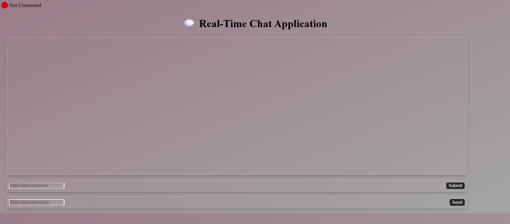
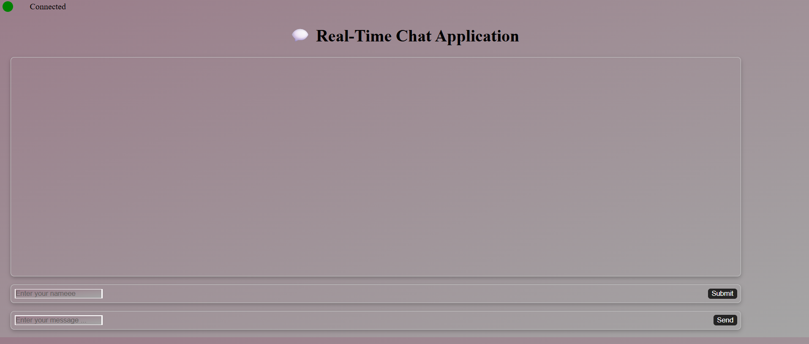
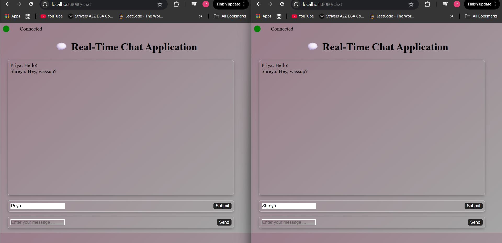
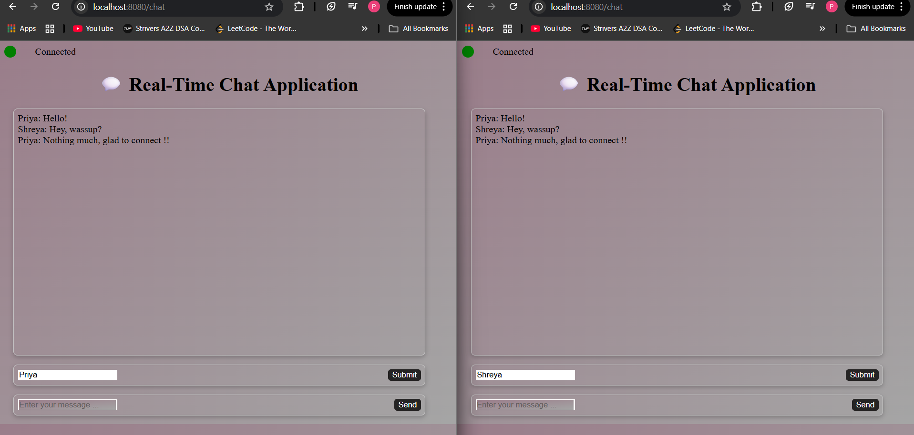
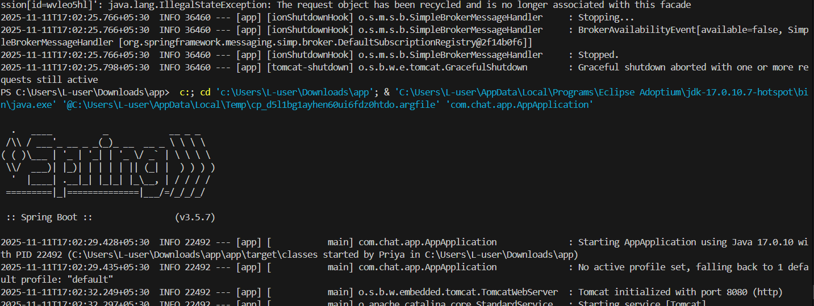

# Real-Time Chat Application (WebSocket + Spring Boot)

A **real-time chat application** built using **Java Spring Boot**, **WebSockets**, and **Thymeleaf**.  
This project demonstrates bi-directional communication between the client and server, enabling instant message exchange without page reloads.

---
 
**1️. Before Connection**  The user sees “Not Connected” indicator and disabled message input.

**2️. After Connection Established**  Status changes to “Connected”, message box enabled. 

**3️. Real-Time Messaging**  Messages sent and received in real-time. 

**4. Spring Application** The spring backend runs and launches frontend with the socket connection via stomp client

## Features

### 1. Real-Time Communication
- Uses **WebSocket** protocol with **STOMP** (Simple Text Oriented Messaging Protocol).
- Allows users to send and receive messages instantly once connected to the server.

### 2. Connection Status Indicator
- Shows **"Not Connected"** before establishing the WebSocket connection.  
- Dynamically changes to **"Connected"** once the connection is successfully established.

### 3. Live Message Exchange
- Messages appear in real-time across all connected users’ browsers.
- Each user can send and receive messages instantly.

### 4. Frontend + Backend Integration
- Frontend uses **Thymeleaf** templates for dynamic rendering.
- Backend built with **Spring Boot** WebSocket support for message broadcasting.

---

## Tech Stack

| Layer | Technology | Description |
|-------|-------------|-------------|
| **Backend** | Java, Spring Boot | REST + WebSocket-based backend for connection and message handling |
| **Messaging** | STOMP over WebSocket | Handles real-time message transmission |
| **Frontend** | HTML, CSS, JavaScript, Thymeleaf | Interactive UI with live message updates |
| **Build Tool** | Maven | Dependency management and build |
| **Server** | Embedded Tomcat (Spring Boot default) | Runs the WebSocket endpoint |
| **Optional** | Bootstrap (if used) | For styling and responsiveness |

---

## How It Works

1. The client loads `chat.html`.
2. On page load, a WebSocket connection is made to `/chat`.
3. The user can then send messages, which are:
   - Sent to the backend via STOMP.
   - Broadcast to all connected clients.
4. The **status indicator** and messages update dynamically on the page.

